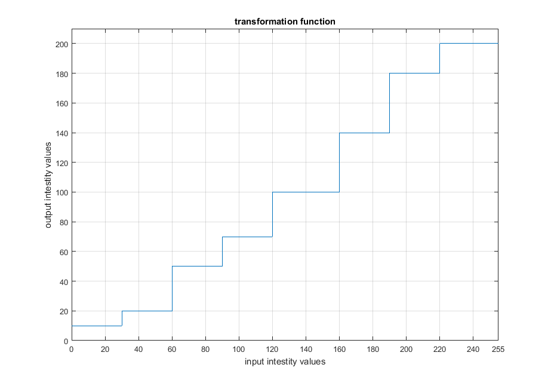
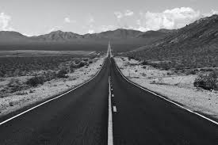
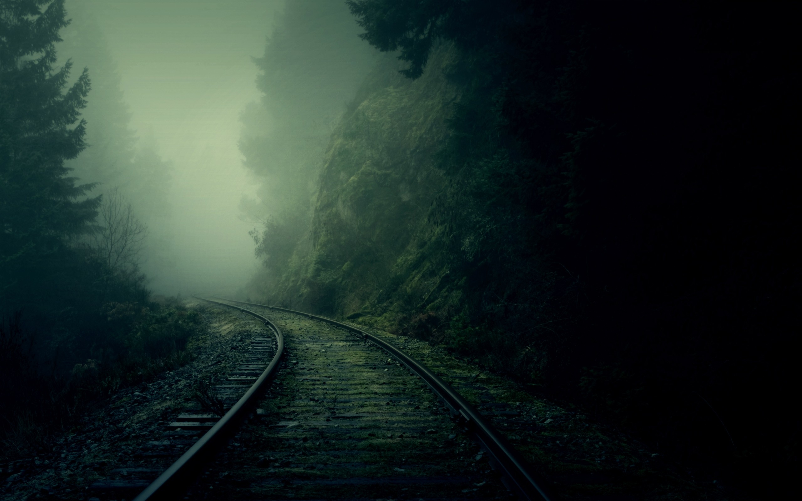
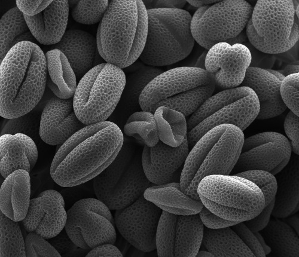
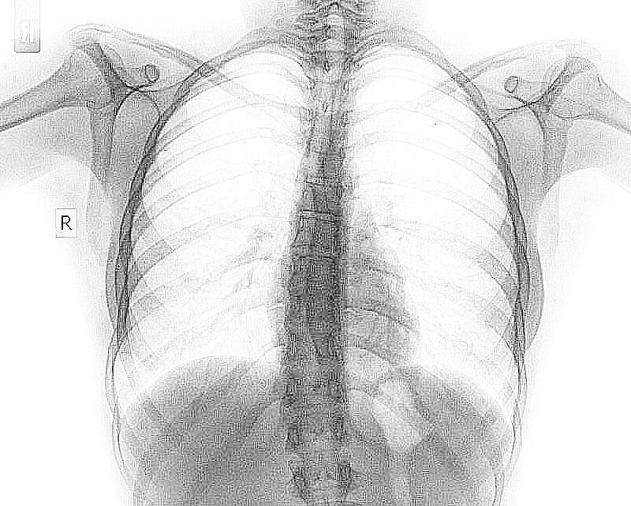
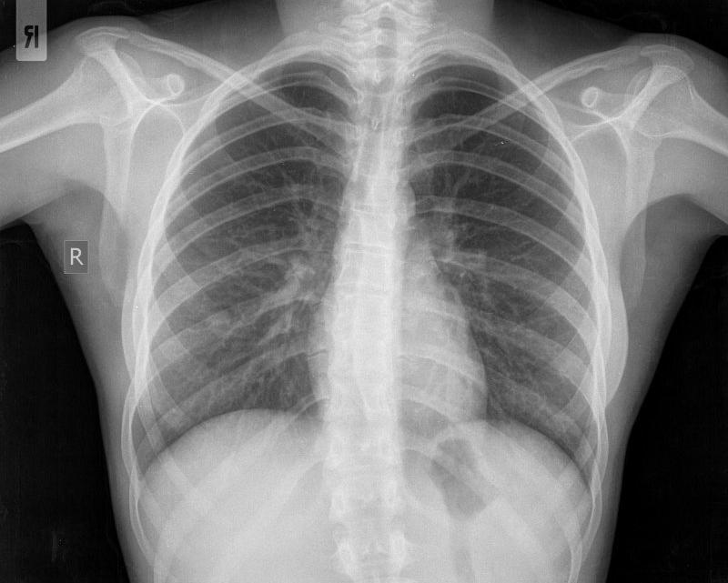

# image-enhancement
Multiple processing techniques to analyze and enhance images

## Notes

* Notebook developed in Jupyter
* The whole code lies in ImageProecessing.ipynb

## Tasks
1.
    *  Explain the impact of the following transformation function on a grayscale image, in terms of intensity values and brightness.  
     

 
    *  Verify by applying the transformation on an image of choice (including input/output images)  
     

 
2. Propose a method for enhancing the image “nature_dark_forest.jpg” in terms of the perceived light and color  
 

   
3. Propose a method for improving the image “pollen-500x430px-96dpi.jpg” in terms the perceived brightness  
 

   
4.
    *  Try to guess the processing steps adopted. (Note the dynamic range and brightness of the enhanced image, and the noise introduced.)  
     

 
    *  Propose a pipeline of processes with the aim of approximating “image_1” starting from “image_2”  
     

 
     

 
